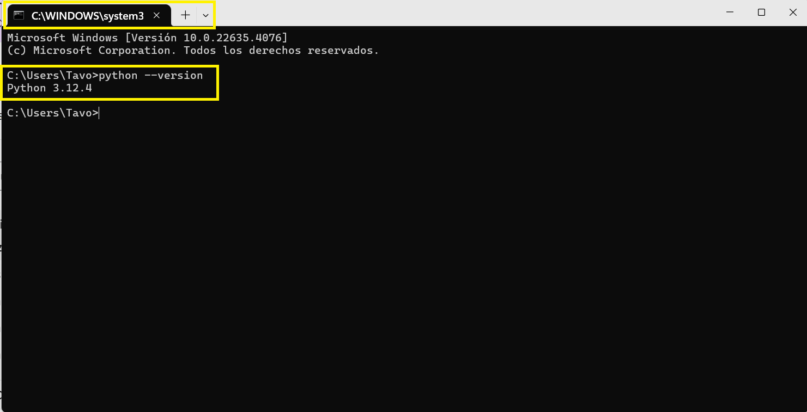
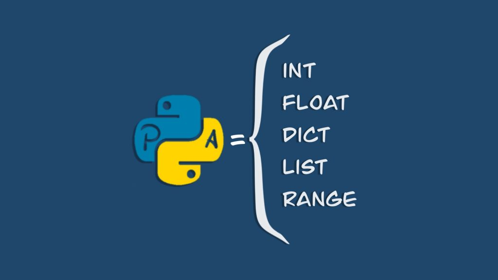
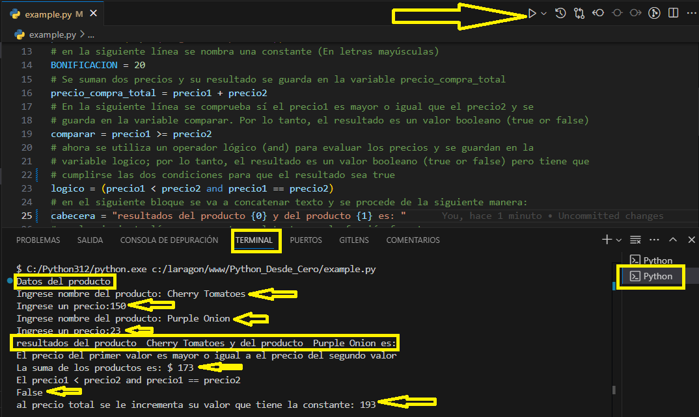
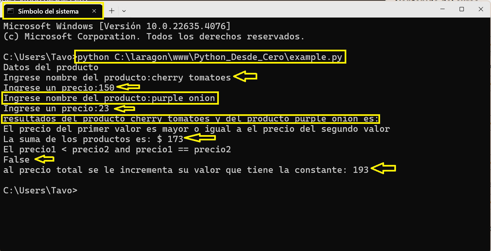
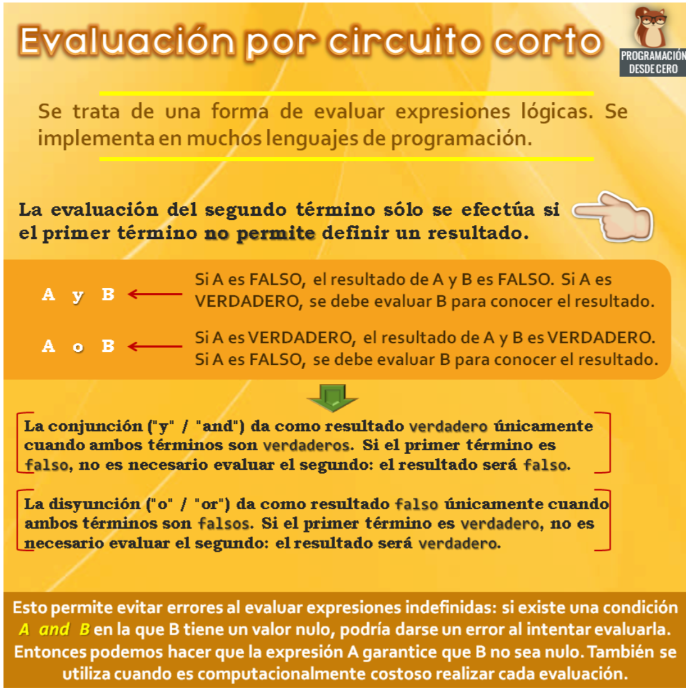

# **_Python DESDE CERO_**


## 1. Random Joke Generator


## 2. Profile View Counter


## 3. Repository View Counter - HITS

[](https://hits.sh/github.com/silentsoft/hits/)

## Agradecimientos

Es muy importante aclarar que, lo expuesto en este pequeño pero, gran tutorial "Python desde cero" es que la mayoría de los conceptos los adquirí de la plataforma educativa [Udemy](https://www.udemy.com/mobile/ipad/) que a lo largo de los años he utilizado mucho por su variedad de información con respecto de los cursos como de sus magistrales educadores; la verdad me siento muy agradecido con esta plataforma educativa; para lo que les deseo muchos éxitos y prosperidad.

No obstante, también un agradecimiento muy especial a las diferentes páginas web que he consultado y que se referencian en este tutorial y muy especialmente a [GitHub](https://github.com/) por sus valiosos aportes en la documentación como de la orientación de diferentes usuarios de esta.

De otra parte, agradecer personalmente al Profe "**Gildardo Patiño Trillos**" quién ha sido mi mentor desde los inicios en mi Carrera como estudiante de Ingeniería de Sistemas realizado en la sagrada Universidad Cooperativa de Colombia [UCC](https://ucc.edu.co/).

## **Introducción**

inicialmente, dar un gran ¡Hola y bienvenidos al tutorial "Python desde cero"! Si alguna vez ha querido aprender a programar, pero no sabía por dónde empezar, se encuentra en el lugar adecuado. Para muchos es de pleno conocimiento que, Python es un lenguaje de programación increíblemente versátil y amigable para principiantes, conocido por su sintaxis clara y su amplia aplicabilidad en el desarrollo web, la ciencia de datos, la inteligencia artificial, la automatización y muchos más temas que concierne este lenguaje de programación.

En este tutorial, se tiene un paso a paso desde los conceptos básicos hasta algunas técnicas más avanzadas. No se necesita tener ninguna experiencia previa en programación; aquí se cubre lo necesario para poder empezar a programar en [Python](https://www.python.org/) con confianza.

> ## Tabla de Contenido

- Sistema Operativo.
- ¿Qué se puede aprender en este tutorial?
- ¿Qué es Python?
- Instalación de Python
- En Windows
- MacOS/Linux
- Configurar un Entorno de Desarrollo
- Sintaxis de Python
- ¿Qué son los Comentarios en los lenguajes de programación?
- Los bloques de código en Python se definen de la siguiente manera
- Múltiples líneas
- Creando variables
- Nombrando variables
- Uso de paréntesis
- Asignación de Valores
- Tipos de Variables
- Nombres de Variables
- Uso de Variables
- Reglas y consejos
- Conclusión
- Paso por valor y por referencia
- Variable global en Python
- Uso de la función print()
- Creación de nuestro primer archivo

## Sistema Operativo

Para este tutorial se utilizó especialmente el Sistema Operativo [Windows 11](https://www.microsoft.com/es-es/windows/windows-11?msockid=0c139a73357f6d0404c38e9134546c48&r=1) pero, es a discreción del lector el uso de su del sistema de su preferencia.

## ¿Qué se puede aprender en este tutorial?

En realidad para este tutorial se puede aprender mucho más de lo que nos imaginamos; Debido a que esto depende en gran medida de los deseos que que tengamos nosotros como estudiantes de incrementar los conocimientos en este apasionante lenguaje de programación. Es así como en este tutorial se nombraran los siguientes temas:

- Sintaxis y estructura del lenguaje
- Tipos de datos (números, cadenas, booleanos, listas, diccionarios)
- Operadores aritméticos y lógicos
- Control de flujo (condicionales, ciclos)
- Funciones básicas (definición y llamada)
- Conceptos prácticos entre otros.

### Conceptos Básicos

- Manipulación de cadenas y strings
- Trabajando con listas y tuplas
- Uso de diccionarios y objetos
- Entrada y salida de datos (input/output)

### Desarrollo de Habilidades

- Resolución de problemas y ejercicios prácticos
- Aprendizaje por ensayo y error
- Mejora de la lectura y comprensión del código

### Ventajas de este tutorial sencillo

- Aprendizaje rápido y efectivo
- Fácil de seguir y entender
- Permite explorar y experimentar con el lenguaje
- Prepara al estudiante para aprender conceptos más avanzados

En resumen, este tutorial sencillo de [Python](https://www.python.org/) en algunos casos puede enseñar los elementos básicos del lenguaje, conceptos prácticos, programación estructurada y habilidades para desarrollar proyectos y resolver problemas. A lo largo del tutorial, se encuentran ejemplos prácticos, ejercicios y consejos que pueden ser de gran ayuda a reforzar el aprendizaje de este lenguaje de programación. Uno de los tantos de los objetivos de este tutorial es que no solo se comprenda cómo funciona [Python](https://www.python.org/) a un nivel básico; sino que, también sentirse cómodo y motivado para seguir explorando y creando por propia cuenta.

Es de entender que, este tutorial es un abrebocas de lo que puede llegar a ser [Python](https://www.python.org/); pero son unos conceptos que se han extraído en su mayor parte de la web como también muy personales; con otra forma de ver este maravilloso mundo del lenguaje de programación como lo es Python.

¡Así que agarra tu computadora, abre tu editor de texto favorito, y prepárate para sumergirte en el emocionante mundo de la programación con [Python](https://www.python.org/)!

## 1. **¿Qué es Python?**

[Python](https://www.python.org/) es un lenguaje de programación de alto nivel, interpretado y de propósito general, que soporta múltiples paradigmas de programación, incluyendo programación estructurada, orientada a objetos y funcional. Fue desarrollado por [Guido van Rossum](https://es.wikipedia.org/wiki/Guido_van_Rossum) y lanzado por primera vez en 1991. Python es conocido por su enfoque en la legibilidad del código, lo que permite a los desarrolladores expresar conceptos de manera concisa y clara.

_Ilustración 1_

Fuente: [Guido van rossum](https://es.wikipedia.org/wiki/Guido_van_Rossum)

[Python](https://www.python.org/) cuenta con un sistema de tipado dinámico y una gestión automática de memoria, lo que lo hace flexible y eficiente para una amplia gama de aplicaciones. Además, Python tiene una extensa biblioteca estándar y un ecosistema robusto de paquetes y módulos de terceros que extienden sus capacidades a áreas como desarrollo web ([Django](https://unipython.com/que-es-django/), [Flask](https://www.epitech-it.es/flask-python/)), análisis de datos ([Pandas](https://pandas.pydata.org/), [NumPy](https://datascientest.com/es/numpy-la-biblioteca-python)), inteligencia artificial ([TensorFlow](https://www.tensorflow.org/learn?hl=es-419), [PyTorch](https://es.wikipedia.org/wiki/PyTorch)), [automatización](https://www.udemy.com/course/automatiza-tu-vida-con-python/?couponCode=SKILLS4SALEB), [scripting](https://learn.microsoft.com/es-es/windows/python/scripting) y más.

El intérprete de [Python](https://www.python.org/) puede ser ejecutado en múltiples plataformas (Windows, macOS, Linux), lo que facilita el desarrollo y la implementación de aplicaciones en diferentes entornos. Además, Python es un lenguaje interpretado, lo que significa que el código se ejecuta línea por línea, permitiendo una depuración y pruebas más rápidas, aunque con un rendimiento potencialmente inferior en comparación con los lenguajes compilados. Claro está que, lo dicho aquí no lo es un todo; solamente es un simple resumen muy personal del mundo que es **Python**.

## 2. **Instalación de Python**

Antes de empezar a programar, se necesita instalar Python en el ordenador y/o computadora.

1. **En Windows**

    - Se visita la página oficial de Python: [Python.org](https://www.Python.org/downloads/). Por favor ver la ilustración 1.

    - Descarga la última versión de Python.
        _Ilustración 1_

    
    Fuente: [Python](https://www.Python.org/downloads/) y Propia.

Es de entender que, existen varias formas de ingresar el [path](https://www.scielo.org.mx/avaliacao/manual_marcacion/instalacion_markup_paths.html) de Python a las variables de entorno del sistema, por lo que, se pueden seguir estos pasos en Windows y en sistemas basados en Unix como Linux y macOS:

**En Windows:**

- Ir a la configuración avanzada del sistema (Control Panel > Sistema > Propiedades > Configuración avanzada del sistema).
- Hacer clic en “Variables del sistema” posteriormente en la acción “Editar”.
- Se busca la variable “Path” y hacer clic con el botón derecho en ella. Luego, selecciona “Editar”.
- Agrega el path de Python al final de la lista de rutas de acceso separadas por punto y coma (;). Por ejemplo, si el path de Python se encuentra en `C:\Python39\bin`, asegúrate de agregar `;C:\Python39\bin` al final de la lista.

**En sistemas basados en Unix:**

- Se abre el archivo `.bashrc` o `.zshrc` (según el shell que se esté utilizando) con un editor de texto.
  Agrega la siguiente línea al final del archivo: `export PATH=$PATH:/ruta/de/python/bin` (reemplaza /ruta/de/python/bin con la ruta real del directorio bin de Python en tu sistema).
  Guardar el archivo y cerrar el editor.
  Recarga la configuración del shell ejecutando `source ~/.bashrc` (o `source ~/.zshrc` según el caso).

> [Nota]

Sí en algún caso, se está usando Python-dotenv, no es necesario agregar el path de Python a las variables de entorno manualmente. En su lugar, se puede crear un archivo `.env` con las variables de entorno y cargarlas en la aplicación Python utilizando la biblioteca [Python-dotenv](https://www.dotenv.org/docs/languages/python.html).

Para acceder a las variables de entorno en Python, utiliza el módulo `os`. Por ejemplo:

```python
import os

print(os.environ['PATH'])  # Imprime el valor actual de la variable Path
```

Es muy importante tener en cuenta que, las variables de entorno son específicas de la sesión actual y se eliminan cuando se cierra la terminal o el shell. Si se necesita persistir las variables de entorno entre sesiones, considera utilizar un archivo de configuración o un gestor de entornos como [virtualenv](https://osl.ugr.es/2016/10/17/entornos-virtuales-en-python-con-virtualenv/).

_Ilustración 2_

Fuente: Propia.

Ahora, al seguir los pasos de instalación intuitivos que brinda el programa se puede llegar a un feliz término de esta; seguidamente, se puede asegurar de que todo esté correctamente configurado; escribiendo en una terminal CMD Python3 --version. Realmente los pasos son muy sencillos. Ver ilustración 3.

_Ilustración 3_


**MacOS/Linux**:

- Por favor tener en cuenta que, [Python](https://www.python.org/) suele estar preinstalado en estos sistemas. Para esto se puede verificar abriendo una terminal o ejecutar y dentro de esta terminal se escribe el siguiente comando: `Python --version`

_Ilustración 4_

Fuente: [Python](https://www.Python.org/downloads/) y Propia.

- Si no está instalado, se puede instalar utilizando un gestor de paquetes como brew (en macOS) o apt-get (en Ubuntu).```brew install Python```.

O en su defecto se puede escribir `sudo apt-get install Python3`

## **3. Configurar un Entorno de Desarrollo**

Inicialmente, para escribir y ejecutar el código en Python, se necesita un entorno de desarrollo. Pare esto se tienen algunas opciones y/o sugerencias:

- [IDLE](https://docs.Python.org/3/library/idle.html) (Python's Integrated Development and Learning Environment): Este, viene con la instalación de Python. Es simple y fácil de usar para empezar.

_Ilustración 5_

Fuente: Propia.

- [VS Code](https://code.visualstudio.com/): Para la realización de este tutorial se utilizó este IDLE. Siendo este un editor de texto poderoso y personalizable y con un excelente soporte para Python.

_Ilustración 6_

Fuente: [Vs Code](https://code.visualstudio.com/ "Python IDLE") y propia.

- [PyCharm](https://www.jetbrains.com/es-es/pycharm/): Es un IDLE más avanzado, con muchas herramientas para facilitar el desarrollo en Python.

_Ilustración 7_

Fuente: [PyCharm](https://www.jetbrains.com/es-es/pycharm/) y propia.

> [!Nota]

Para este tutorial se utilizó el Editor de Texto VS Code. Pero es a discreción del usuario el editor que quiera utilizar. Otro aspecto que se debe de conocer también es ciertos aspectos relevantes para lograr a comprender un poco este tema tan apasionante como lo es [Python](https://www.python.org/) es conocer su sintaxis.

## Sintaxis de Python

A continuación se presenta el tema de la sintaxis de [Python](https://www.python.org/); este vendría a ser la forma de empezar a usar el lenguaje Python con el objeto de ir creando y/o analizando sobre ¿Qué son las variables y estructuras de control?.

El termino [sintaxis](https://dle.rae.es/sintaxis?m=form) hace referencia al conjunto de reglas que definen las secuencias correctas de los elementos de un lenguaje de programación; de cómo se debe de escribir el código en un determinado lenguaje de programación. En resumen, hace referencia a la forma en la que se debe escribir las instrucciones para que el ordenador, o más bien el lenguaje de programación entienda lo que se está solicitando.

Como es de común acuerdo, en la mayoría de los lenguajes existe una sintaxis propia de cada lenguaje, también existen similitudes como por ejemplo, el uso del término matemático (igual) `=` para asignar un dato a una variable, o el uso de los famosos corchetes `{}` para designar bloques de código, pero [Python](https://www.python.org/) tiene ciertas particularidades.

Por lo tanto, la sintaxis viene siendo tan importante para la programación como lo que es la gramática para los idiomas. Se puede dar un pequeño comentario acerca de la frase "Yo estamos aquí" escribirla así no es correcta y el siguiente código en [Python](https://www.python.org/) no sería correcto, ya que no respeta las normas del lenguaje. Durante el transcurso del tutorial se va analizando un poco lo que se describe la manera correcta de saber acerca de la sintaxis en Python; por ejemplo:

```Python
if ($variable){
    x=9;
}
```

El anterior código, lo veremos a continuación en detalle; pero, lo importante de [Python](https://www.python.org/) es que no soporta el uso de lo que se conoce como el signo pesos `$` ni hace falta terminar las líneas con el signo de puntuación punto y coma (`;`) como en otros lenguajes, y tampoco hay que usar `{}` en estructuras de control como en el `if`.

De la misma forma que, un idioma no se habla con simplemente saber todas sus palabras, en la programación no basta con saber la [sintaxis](https://pythones.net/sintaxis-basica-del-lenguaje/) de un lenguaje para programar correctamente en este. También es cierto, que sabiendo la sintaxis se puede empezar a programar y a hacer muchas cosas con la sintaxis; pero, utilizar un lenguaje de programación va mucho más allá de la sintaxis.

Ahora, con el objeto de empezar a perderle el miedo a la sintaxis de [Python](https://ellibrodepython.com/sintaxis-python), se puede ver un ejemplo donde se observa **cadenas**, **operadores aritméticos** y el uso del condicional `if`; entre otros. Así, el siguiente código simplemente define tres valores a, b y c, realiza unas operaciones con ellos y muestra el resultado por pantalla.

```Python
# Se define una variable x con una cadena
x = "El valor de (a+b)*c es"

# Se pueden realizar múltiples asignaciones
a, b, c = 4, 3, 2

# También se pueden realizar unas operaciones con a,b,c
d = (a + b) * c

# Y se define una variable booleana
imprimir = True

# Y por lo tanto se debe de imprimir, ``print()``
if imprimir:
    print(x, d)

# Por lo que la salida: El valor de (a+b)*c es 14
```

Al observar el anterior código, se tiene que, la sintaxis de [Python](https://www.python.org/) es muy parecida al lenguaje natural o  por [Kiko Palomares](https://github.com/KikoPalomares "Kiko Palomares"). Entonces, El [pseudocódigo](https://programacion.top/conceptos/pseudocodigo/) es una representación textual de un [algoritmo](https://www.epitech-it.es/algoritmo-diferentes-tipos/) o proceso, escrito de manera que imita el lenguaje de programación; pero, no es específico de un lenguaje en particular. Es como una forma de expresar los pasos que va a realizar un programa de manera clara y concisa, utilizando estructuras de control, sentencias de asignación y comentarios para explicar el proceso.

A diferencia de un lenguaje de programación real, el pseudocódigo no es ejecutable directamente por la máquina, sino que se utiliza como intermediario entre la resolución de problemas y la codificación real en un lenguaje de programación. Esto permite a los programadores trabajar de manera independiente del lenguaje, centrándose en el algoritmo y su lógica, lo que facilita la colaboración y la comprensión mutua. Con esto en mente, lo que hace el pseudocódigo es que sea relativamente fácil de leer y comprender.

Volviendo al código anterior, puede ser ejecutado tal cual está. Ahora al tener conocimientos en otros lenguajes como C o Java, esto resultará de mucha utilidad, ya que no es necesario crear la típica función `main()`. Pero, obsérvese que se tienen unos comentarios para ir describiendo lo que puede o tiene el código.

## ¿Qué son los Comentarios en los lenguajes de programación?

como su nombre lo indica, los [comentarios](https://oregoom.com/python/comentarios/) son bloques de texto usados para comentar el código. Es decir, para ofrecer información relevante tanto el que lo escribe como para otros programadores y que a su vez ofrece información relevante acerca del código que se está escribiendo. Para efectos prácticos, en [Python](https://www.python.org/) como para algunos lenguajes de programación es como si no existieran esas líneas o códigos, ya que no son **código** propiamente dicho, solamente son anotaciones de lo que expresa esa línea o ese bloque de código. Y los comentarios se inician con el signo numeral `#` y todo lo que vaya después en la misma línea será considerado como un comentario. Ejemplo:

```Python
# Esto es un comentario
```

Como se mencionó anteriormente, al igual que en otros lenguajes de programación, podemos también comentar varias líneas de código. Para ello es necesario hacer uso de triples comillas bien sean simples, inclinadas `'''` o dobles `"""`. Por lo que, es necesario usarlas tanto para abrir el bloque del comentario y como para cerrarlo.

```Python
Por supuesto esto es un comentario
compuesto de varias líneas
de código
```

## Indentación y bloques de código en Python

La indentación en [Python](https://es.quora.com/Por-qu%C3%A9-Python-usa-indentaci%C3%B3n-con-prop%C3%B3sitos-funcionales) es la práctica de utilizar espacios o tabuladores para indentar los bloques de código. Esta indentación es necesaria para indicar la estructura jerárquica de los comandos y controlar la fluidez del programa. En Python, los bloques de código se definen mediante la indentación, es decir, al utilizar espacios o tabuladores para indentar las líneas dentro de un bloque.

por lo tanto, es importante mantener consistencia en la indentación a lo largo del código; debido a que, Python no tiene un límite explícito de indentación, sino que se basa en la lógica de que las líneas identadas pertenecen al mismo bloque. Por lo general, se utiliza cuatro espacios para la indentación, pero esto puede variar según las preferencias personales del desarrollador.

### Los bloques de código en Python se definen de la siguiente manera

- Un bloque `if` se identifica con una indentación adicional después de la palabra clave `if`.
- Un bloque `elif` se identifica con una indentación adicional después del bloque `if` precedente.
- Un bloque `else` se identifica con una indentación adicional después del bloque `elif` o `if` precedente.
- La indentación se deshace al llegar al final del bloque, lo que indica el regreso a la instrucción principal.

En el siguiente ejemplo, el bloque `if` se identifica con cuatro espacios, y los bloques `elif` y `else` también se identifican con cuatro espacios respectivos. El código dentro de cada bloque está indentado también con cuatro espacios para mostrar claramente la estructura del programa.

En resumen, la indentación en [Python](https://www.python.org/) es esencial para definir los bloques de código y controlar la fluidez del programa. Es importante mantener consistencia en la indentación a lo largo del código y utilizar una cantidad consistente de espacios o tabuladores para indentar las líneas.

#### Código de ejemplo en Python

```Python
if edad <= 2:
    print('Vuelo gratuito')
elif 2 < edad < 13:
    print('Tarifa de niño')
else:
    print('Tarifa para adultos')
```

> [!Nota]:

En este ejemplo, se utiliza cuatro espacios para la indentación. Sin embargo, es importante mantener consistencia en esta a lo largo del código y utilizar la cantidad de espacios o tabulaciones que se prefiera.

Generalmente, En [Python](https://www.python.org/) los bloques de código se representan con indentación, y aunque hay un poco de debate con respecto a usar la tecla tabulador o cuatro (4) espacios, la norma general es usar cuatro espacios. Obsérvese otro ejemplo.

En el siguiente código se tiene un condicional `if`. Justo después aparece un `print()` indentado con cuatro espacios. Por lo tanto, todo lo que tenga esa indentación pertenecerá al bloque del `if`.

```Python
if True:
    print("True")
```

Esto es muy importante ya que, el código anterior y el siguiente no son lo mismo. De hecho, el siguiente código daría un error ya que el `if` no contiene ningún bloque de código, y eso es algo que no se puede hacer en Python.

```Python
if True:
print("True")
```

Como se mencionara en anteriores líneas a diferencia que en otros lenguajes de programación, no es necesario utilizar el signo de punto y coma (;) para terminar cada línea.

```c
# Otros lenguajes como C requieren del signo de puntuación punto y coma (;) al final de cada línea

x = 10;
```

Sin embargo, en Python no es necesario, basta con un salto de línea.

```Python
x = 5
y = 10
```

Pero se puede usar el signo de puntuación punto y coma (;) para tener dos sentencias en la misma línea.

```Python
x = 5; y = 10
```

### Múltiples líneas

En algunas situaciones se puede dar el caso de que se quiera tener una sola instrucción en varias líneas de código. Uno de los motivos principales podría ser que fuera demasiado larga, y de hecho en la especificación [PEP8](https://dev.to/viktorvillalobos/que-es-el-pep-8-y-porque-deberia-implementarlo-54bh) se recomienda que las líneas no excedan los 80 caracteres, usar cuatro espacios en la indentación en vez de tabs y otras más.

Haciendo uso de la barra inclinada invertida (\) se puede romper el código en varias líneas, lo que en determinados casos hace que el código sea mucho más legible.

```Python
x = 1 + 2 + 3 + 4 +\
    5 + 6 + 7 + 8
```

Si por lo contrario estamos dentro de un bloque rodeado con paréntesis (), bastaría con saltar a la siguiente línea.

```Python
x = (1 + 2 + 3 + 4 +
     5 + 6 + 7 + 8)
```

Se puede hacer lo mismo para llamadas a funciones

```Python
def funcion(a, b, c):
    return a+b+c

d = funcion(10,
23,
3)
```

### Creando variables

Anteriormente, se ha visto como crear una variable y asignarle un valor con el uso del operador `=`. Existen también otras formas de hacerlo de una manera un poco más sofisticada.

Por ejemplo, asignar el mismo valor a diferentes variables con el siguiente código.

```Python
x = y = z = 10
```

O también se puede asignar varios valores separados por coma.

```Python
x, y = 4, 2
x, y, z = 1, 2, 3
```

### Nombrando variables

De igual manera, se pueden nombrar las variables como se quiera nombrar, pero es importante saber que las mayúsculas y minúsculas son importantes. Las variables `x` (en minúscula) y `X` (en mayúscula) son distintas.

Por otro lado, existen ciertas normas a la hora de nombrar variables:

- El nombre no puede empezar por un número
- No se permite el uso de guiones -
- Tampoco se permite el uso de espacios.

Se muestran unos ejemplos de nombres de variables válidos y no válidos.

```Python
# Válido

_variable = 10
vari_able = 20
variable10 = 30
variable = 60
variaBle = 10

# No válido

2variable = 10
var-iable = 10
var iable = 10
```

Una última condición para nombrar a una variable en Python, es no usar nombres reservados para Python. [Las palabras reservadas](https://ellibrodepython.com/palabras-reservadas-python) son utilizadas por Python internamente, por lo que no se pueden utilizar para las variables o funciones.

```Python
import keyword
print(keyword.kwlist)

# ['False', 'None', 'True', 'and', 'as', 'assert'

# 'async', 'await', 'break', 'class', 'continue'

# 'def', 'del', 'elif', 'else', 'except', 'finally'

# 'for', 'from', 'global', 'if', 'import', 'in', 'is'

# 'lambda', 'nonlocal', 'not', 'or', 'pass', 'raise'

# 'return', 'try', 'while', 'with', 'yield']
```

De hecho, con el siguiente comando se pueden ver todas las palabras clave que no se pueden utilizar.

```Python
import keyword
print(keyword.kwlist)
```

### Uso de paréntesis

Python soporta todos los  más comunes, conocidos como operadores aritméticos. Por lo tanto, se pueden realizar sumas, restas, multiplicaciones, exponentes (usando \*\*) y otros que no se explican por el momento. Por ejemplo, se realizan varias operaciones en la misma línea, y se almacenan su resultados en y.

```Python
x = 10
y = x*3-3**10-2+3
```

Pero el comportamiento del código anterior y el siguiente es distinto, ya que el uso de paréntesis () da prioridad a unas operaciones sobre otras.

```Python
x = 10
y = (x*3-3)**(10-2)+3
```

El uso de paréntesis no solo se aplica a los operadores aritméticos, sino que también pueden ser aplicados a otros operadores como los **relacionales o de membresía**. En Python, los operadores relacionales o de membresía se utilizan para comparar valores y evaluar condiciones booleanas. Estos operadores se definen como sigue:

- == (igual que): evalúa si el valor del lado izquierdo es igual al valor del lado derecho.
- != (diferente): evalúa si el valor del lado izquierdo es diferente al valor del lado derecho.
- > (mayor que): evalúa si el valor del lado izquierdo es mayor que el valor del lado derecho.
- < (menor que): evalúa si el valor del lado izquierdo es menor que el valor del lado derecho.
- > = (mayor o igual que): evalúa si el valor del lado izquierdo es mayor o igual que el valor del lado derecho.
- <= (menor o igual que): evalúa si el valor del lado izquierdo es menor o igual que el valor del lado derecho.

Estos operadores se utilizan comúnmente en sentencias `if` y `elif` para tomar decisiones basadas en condiciones específicas. Por ejemplo:

```Python
x = 5
if x > 3:
    print("x es mayor que 3")
elif x == 5:
    print("x es igual a 5")
else:
    print("x es menor que 3")
```

En el anterior ejemplo, se evalúa la condición x > 3 y, si es verdadera, se imprime el mensaje correspondiente. Si no es verdadera, se evalúa la condición x == 5 y, si es verdadera, se imprime otro mensaje. Si ninguna de las condiciones es verdadera, se ejecuta el bloque `else`.

Además, los operadores relacionales también se utilizan en expresiones que asignan valores booleanos, como en un ejemplo simple:

```Python
a = 4
b = 5
resultado = a <= b  # resultado es True
```

En este caso, el operador `<=` evalúa la condición y devuelve un valor booleano (True en este caso). Este valor booleano se puede utilizar en sentencias `if` o en otras expresiones.

Recuerda que los operadores relacionales son estrictos, lo que significa que 4 no es considerado igual a 4.0, por ejemplo. Si se necesita comparar valores numéricos con precisión decimal, se debe utilizar bibliotecas adicionales como `decimal` o `fractions` que vendría a ser otro tema de presentación más adelante.

### Variables y alcance


Fuente: [Pytonista](https://elpythonista.com/variables-python)

En [Python](https://www.python.org/), una variable es **_un espacio de memoria reservado para almacenar un valor_**. No se necesita declarar las variables antes de utilizarlas, ya que se crean automáticamente cuando se les asigna un valor. Las variables en Python son dinámicas, lo que significa que no se necesita especificar de antemano qué tipo de valor almacenarán.

### Asignación de Valores

Se asignan valores a las variables utilizando el operador de asignación `=` (igual). Por ejemplo, `x = 5 asigna el valor 5 a la variable x`. También se pueden asignar cadenas de texto, como `nombre = "Juan"` o valores booleanos, como `activo = True`.

### Tipos de Variables

[Python](https://www.python.org/) es un lenguaje de tipo dinámico, lo que significa que no se necesita especificar el tipo de variable al declararla. Sin embargo, se pueden categorizar las variables en:

1. **_Variables numéricas_** (int, float): Almacenan números enteros o decimales.
2. **_Variables de texto_** (str): Almacenan cadenas de caracteres.
3. **_Variables booleanas_** (bool): Almacenan valores verdaderos o falsos.
4. **_Variables complejas_** (objeto): Almacenan objetos más complejos, como listas, diccionarios, etc.

### Nombres de Variables

En Python, los nombres de variables deben cumplir las siguientes características:

1. Deben empezar por una letra o underscore (\_).
2. Deben ser en minúsculas y separar palabras con underscore (\_).
3. No pueden contener espacios ni caracteres especiales, excepto underscore (\_).

### Uso de Variables

Las variables se utilizan para almacenar y manipular datos en un programa. Se pueden asignar valores, realizar operaciones aritméticas y lógicas, y utilizarlas en condiciones de control de flujo.

En resumen, las variables en Python son espacios de memoria dinámicos que se crean automáticamente al asignarles un valor, y se pueden utilizar para almacenar y manipular diferentes tipos de datos. Las variables y constantes pueden contener valores de diversos tipos; por ejemplo:

- Cadenas de texto (string): miCadena = "Hola Mundo"
- Número entero: edad = 35
- Número entero local: edad = 043
- Número entero hexadecimal: edad = 0x23
- Número real: real= 7435028
- Booleano (verdadero/falso): verdadero = true
  falso = false

## Operadores aritméticos

Cabe destacar que, los [operadores aritméticos](https://apuntes.de/python/operadores-aritmeticos-y-de-asignacion-en-python/#gsc.tab=0); son aquellos que realizan operaciones matemáticas básicas, como la suma (+), la resta (-), la multiplicación (\*), la división (/) y el módulo (%). Además, Python también tiene el operador de exponente (\*\*), que eleva un número a una potencia determinada. Por lo tanto, se pueden utilizar los siguientes:

| Símbolo   | Significado     | Ejemplo      | Resultado   |
| --------- | --------------- | ------------ | ----------- |
| +         | suma            | a = 10 + 2   | a es 15     |
| --------- | --------------- | ------------ | ----------- |
| -         | resta           | a = 10 - 2   | a es 8      |
| --------- | --------------- | ------------ | ----------- |
| \*        | multiplicación  | a = -5       | a es -5     |
| --------- | --------------- | ------------ | ----------- |
| \*\*      | exponente       | a = 2\*\*3   | a es 8      |
| --------- | --------------- | ------------ | ----------- |
| /         | división        | a = 12.5 / 2 | a es 6.25   |
| --------- | --------------- | ------------ | ----------- |
| %         | módulo          | a = 27 % 4   | a es 3      |
| --------- | --------------- | ------------ | ----------- |

## Operadores de comparación

En Python, los operadores de comparación se utilizan para evaluar la igualdad o desigualdad entre valores. A continuación, se presentan los operadores más comunes:

| Operador  | Nombre          | Ejemplo      | Funcionalidad                        |
| --------- | --------------- | ------------ | ------------------------------------ |
| ==        | igualdad        | x == y       | Verdadero sí x es = a y              |
| --------- | --------------- | ------------ | ------------------------------------ |
| !=        | diferente       | x !=         | Verdadero sí x no es = a y           |
| --------- | --------------- | ------------ | ------------------------------------ |
| >         | mayor que       | x > y        | Verdadero sí x es mayor que y        |
| --------- | --------------- | ------------ | ------------------------------------ |
| <         | menor que       | x < y        | Verdadero sí x es menor que y        |
| --------- | --------------- | ------------ | ------------------------------------ |
| >=        | mayor o igual   | x >=         | Verdadero sí x es mayor o igual a y  |
| --------- | --------------- | ------------ | ------------------------------------ |
| <=        | menor o igual   | a = 27 % 4   | Verdadero sí x es menor o igual a y  |
| --------- | --------------- | ------------ | ------------------------------------ |

## Operadores Lógicos

Además de los operadores de comparación, también hay operadores lógicos que se utilizan para combinar condiciones y obtener resultados booleanos. Estos son:

- and (y): Evalúa si ambas condiciones son verdaderas.
- or (o): Evalúa si al menos una de las condiciones es verdadera.
- not (no): Invierte el valor de la condición.

Ejemplo:

```python
x = 5
y = 3

print(x > y and x < 10)  # Output: True
print(x > y or x < 10)  # Output: True
print(not x > y)  # Output: False
```

### Observaciones

- Python es un lenguaje case-sensitive, lo que significa que `True` (en mayúsculas) y `true` (en minúsculas) son valores diferentes. En el ejemplo proporcionado, se puede ver cómo el error se produce al asignar `true` en lugar de `True`.
- Para comparar dos variables/valores, se utiliza el operador `==` o uno de los operadores de comparación numérica (e.g., <, >).
- Los operadores lógicos se utilizan comúnmente en condicionales para evaluar múltiples condiciones y obtener resultados booleanos.

Otro aspecto a tener en cuenta es que, cuando se define una variable es saber el alcance o scope que tiene. En el siguiente ejemplo la variable con valor 10 tiene un alcance global y la que tiene el valor 5 dentro de la función, tiene un alcance local. Esto significa que cuando hacemos `print(x)`, estamos accediendo a la variable global x y no a la x definida dentro de la función.

```Python
x = 10

def funcion():
    x = 5

funcion()
print(x)
```

Es normal que al inicio de todo este tema se tenga un concepto un poco complicado de observar; pero, se pueden observar algunos conceptos más adelante para una mayor claridad. Es muy recomendable leer la siguiente información para entender mejor las funciones y el alcance de las variables:

### Funciones en Python y sus argumentos

Las funciones en Python son bloques de código que realizan una tarea específica y pueden ser llamadas desde otras partes del programa. Se definen mediante la palabra clave `def` seguida del nombre de la función y paréntesis que pueden contener parámetros.

### Estructura básica de una función en Python

- def nombre_de_la_funcion(Argumentos):

1. Código que realiza la tarea específica.
2. Puede incluir sentencias `return` para devolver valores.
3. Puede incluir parámetros con valores predeterminados

#### Ejemplos

Una función personalizada que toma un parámetro nombre y devuelve un mensaje de saludo:

```Python
def saludar(nombre):
    print(f"¡Hola, {nombre}!")
```

La función len() es una función incorporada que devuelve la longitud de un objeto:

```Python
print(len("Hola mundo"))  # la longitud es diez (10) caracteres
```

La función input() es una función incorporada que permite obtener la entrada del usuario:

```Python
nombre = input("Ingrese su nombre: ")
print(f"¡Hola, {nombre}!")
```

## Reglas y consejos

1. Utilizar la palabra clave `def` para definir funciones
2. Utilizar paréntesis () para contener parámetros
3. Pueden tener cero (0) o más parámetros
4. Pueden devolver valores utilizando la palabra clave `return`
5. Pueden tener parámetros con valores predeterminados
6. La definición de una función debe ser seguida de dos puntos (:) y el código que la compone debe estar identado con cuatro (4) espacios
7. Las funciones no se ejecutan hasta que no sean invocadas
8. Los parámetros son valores que se esperan recibir cuando se llama a la función

## Conclusión

Las funciones en Python son una herramienta poderosa para organizar y reutilizar el código. Al entender cómo se definen y se utilizan, los programadores pueden escribir programas más eficientes y fáciles de mantener. Es importante seguir las reglas y consejos mencionados para definir y utilizar funciones de manera efectiva.

## Paso por valor y por referencia

Así mismo, en Python, hay dos maneras en que las funciones pueden tratar los parámetros de entrada: paso por valor y paso por referencia.

**1. Paso por valor**: Los tipos simples como enteros, flotantes, cadenas y lógicos se pasan por valor. Esto significa que se crea una copia local de la variable dentro de la función, por lo que cualquier modificación realizada en la función no afecta la variable original. Ver el siguiente ejemplo:

```Python
def incrementar(x): # función llamada incrementar
    x = x + 1 # variable x

x = 5
incrementar(x)
print(x)  # Output: 5
```

En el anterior ejemplo, la variable `x` se pasa por valor a la función incrementar. La modificación realizada en la función `(x = x + 1)` no afecta la variable original `x`, que sigue siendo 5.

**2. Paso por referencia**: Los tipos compuestos como listas, [diccionarios](https://devcode.la/tutoriales/diccionarios-en-Python/) y objetos se pasan por referencia. Esto significa que se envía una copia de la referencia a la variable original, por lo que cualquier modificación realizada en la función afecta la variable original. Ver el siguiente ejemplo:

```Python
def agregar_elemento(numeros): # Función llamada agregar_elemento y variable numeros
    numeros.append(4)

numeros = [1, 2, 3]
agregar_elemento(numeros)
print(numeros)  # Output: [1, 2, 3, 4]
```

En el anterior ejemplo, la variable numeros se pasa por referencia a la función `agregar_elemento`. La modificación realizada en la función (`numeros.append(4)`) afecta la variable original `numeros`, que ahora contiene cuatro elementos.

Para evitar que los tipos compuestos se modifiquen accidentalmente, se puede crear una copia de la lista antes de pasarla como parámetro:

```Python
def agregar_elemento(numeros):
    numeros.append(4)

numeros = [1, 2, 3]
agregar_elemento(numeros[:])  # Crear copia con slicing
print(numeros)  # Output: [1, 2, 3]
```

En este ejemplo, se crea una copia de la lista `numeros` utilizando [slicing](https://naps.com.mx/blog/listas-en-Python/) (`numeros[:]`), y se pasa esa copia como parámetro a la función `agregar_elemento`. La variable original `numeros` no se modifica.

## Variable global en Python

En Python, las variables globales son aquellas definidas en el cuerpo principal del programa, fuera de cualquier función. Estas variables son accesibles desde cualquier punto del programa, incluyendo dentro de funciones. También se puede acceder a las variables globales de otros módulos o programas importados.

Por otro lado, las variables locales son aquellas definidas dentro de una función y solo permiten su acceso desde ella. No se pueden acceder o modificar desde fuera de la función en la que se definen.

Para acceder y modificar variables globales, se puede utilizar la función `globals()`, que devuelve un diccionario que contiene todas las variables del ámbito global actual. Este diccionario se utiliza para acceder al valor de las variables globales y modificarlo. Sin embargo, para variables locales, se utiliza la función `locals()`, que devuelve un diccionario que contiene todas las variables del ámbito local actual, pero no se puede modificar.

A continuación, se presenta un ejemplo que ilustra la diferencia entre variables globales y locales en Python:

```Python
# Variable global llamada global_valor
global_valor = 10

def funcion(): # Función llamada funcion
    # Variable local llamada local_valor
    local_valor = 20
    print(f'La variable local valor es {locals()["local_valor"]}')
    print(f'La variable global valor es {globals()["global_valor"]}')

    # Modificamos la variable global
    globals()['global_valor'] = 30

funcion()
print(f'La variable global valor es ahora {global_valor}')
```

En el anterior ejemplo, se define una variable global llamada `global_valor` y una variable local llamada `local_valor` dentro de la función llamada `funcion`. Luego, se modifica el valor de la variable global utilizando el diccionario devuelto por `globals()`. Al final, se imprime el valor actual de la variable global `global_valor`, que ha sido modificada dentro de la función.

Es importante destacar que las variables locales no se pueden acceder ni modificar desde fuera de la función en la que se definen, mientras que las variables globales pueden ser accedidas y modificadas desde cualquier punto del programa

### Uso de la función `print()`

Por último, en cualquier lenguaje de programación es importante saber lo que va pasando a medida que se ejecutan las diferentes instrucciones. Por ello, es interesante hacer uso de `print()` en diferentes secciones del código, ya que permiten ver el valor de las variables y muestra información útil.

Existen muchas formas de usar la función `print()` y te las explicamos en detalle en este post, pero por ahora basta con que sepas lo básico.

Como ya hemos visto se puede usar `print()` para imprimir por pantalla el texto que se quiera ver.

```Python
print("Esto es el contenido a imprimir")
```

De la misma manera, también es posible imprimir el contenido de una variable.

```Python
x = 10
print(x)
```

Ahora, separando por comas estos valores, es posible imprimir el texto y el contenido de variables.

```Python
x = 10
y = 20
print("Los valores x, y son:", x, y)

# Salida: Los valores x, y son: 10 20
```

## Creación de nuestro primer archivo

De acuerdo con lo anterior, ya se puede iniciar con crear un archivo en el IDLE de VS Code; para esto, se puede iniciar de la siguiente manera; aunque es de conocimiento que existen varias formas de hacerlo. Se procede a crear un archivo con el nombre que quiera utilizar el usuario; no sin antes advertir que debe de tener la extensión punto py (.py);para este caso se llamará example.py. Y este sería el código:

```python
print("Datos de la primera persona")
# Para obtener una cadena de caracteres se utiliza la función input junto con variables
# diferentes por lo tanto, se le permite al usuario que ingrese los datos por teclado.
nombre1 = input("Ingrese nombre del producto:")
# En la siguiente línea se ingresa un valor y se transforma en entero y se acumula ese
# valor en la variable precio1
precio1 = int(input("Ingrese un precio:"))
# En la siguiente línea se ingresa un valor y se acumula en la variable nombre2
nombre2 = input("Ingrese nombre del producto:")
# En la siguiente línea se ingresa un valor y se transforma en entero y se acumula ese
# valor en la variable precio2
precio2 = int(input("Ingrese un precio:"))
# en la siguiente línea se nombra una constante (En letras mayúsculas)
BONIFICACION = 20
# Se suman dos precios y su resultado se guarda en la variable precio_compra_total
precio_compra_total = precio1 + precio2
# En la siguiente línea se comprueba sí el precio1 es mayor o igual que el precio2 y se
# guarda en la variable comparar. Por lo tanto, el resultado es un valor booleano (true or false)
comparar = precio1 >= precio2
# ahora se utiliza un operador lógico (and) para evaluar los precios y se guardan en la
# variable logico; por lo tanto, el resultado es un valor booleano (true or false) pero tiene que
# cumplirse las dos condiciones para que el resultado se true
logico = (precio1 < precio2 and precio1 == precio2)
# en el siguiente bloque se va a concatenar texto y se procede de la siguiente manera:
cabecera = "resultados del producto {0} y del producto {1}: "
# en la siguiente línea se concatena el texto con la función format
print(cabecera.format(nombre1, nombre2))
print("El precio del primer valor es mayor o igual a el precio del segundo valor")
# Otra forma de concatenar es con el signo más (+) y en la variable la propiedad str
print("La suma de los productos es: $ " + str(precio_compra_total))
print("El precio1 < precio2 and precio1 == precio2")
print(logico)
# En la siguiente línea se tiene un operador de asignación
precio_compra_total += BONIFICACION
print("al precio total se le incrementa su valor que tiene la constante: " +
      str(precio_compra_total))
```

Como es de conocimiento para muchos el código se puede ejecutar directamente en una terminal de este archivo directamente. Observar la siguiente ilustración 8.

_Ilustración 8_

Fuente: Propia.

Seguidamente, se tiene la ejecución del código; pero, desde un [CMD](https://tutowindow.com/que-significa-el-comando-cmd/); por favor ver la siguiente ilustración 9.

_Ilustración 9_

Fuente: Propia.

## Condicionales

Las [sentencias condicionales](https://keepcoding.io/blog/expresiones-condicionales-en-python/) son un aparte fundamental en la programación en Python; como, en cualquier lenguaje de programación; por lo general, son una forma de controlar el flujo de ejecución de un programa, permitiendo que el código se ejecute solo cuando se cumplan ciertas condiciones establecidas. A continuación, se presentan algunos de los conceptos básicos y unos ejemplos de cómo utilizarlas:

```python
if expresion_booleana:
     # Código a ejecutar si la expresión es verdadera
else:
     # Código a ejecutar si la expresión es falsa
```

- La sentencia condicional más básica en Python es la sentencia `if`, que se expresa de la siguiente forma: `if condición: código a ejecutar`. La condición se evalúa como verdadera o falsa, y si es verdadera, se ejecutan las líneas de código indentadas debajo de la sentencia `if`.
- Para especificar un código alternativo que se ejecute cuando la condición sea falsa, se utiliza la sentencia `else: if condición: código a ejecutar elif condición2: código a ejecutar else: código a ejecutar por defecto`.
- La sentencia `elif` (short for “else if”) se utiliza para evaluar otra condición si la primera condición es falsa. De esta forma, se pueden verificar múltiples condiciones y ejecutar diferentes bloques de código según sea necesario. por ejemplo:

```python
x = 5

if x > 10:
    print("x es mayor que 10")
elif x == 5:
    print("x es igual a 5")
else:
    print("x es menor que 10")
```

## algunos Consejos

- Es importante tener en cuenta que las sentencias condicionales deben estar indentadas correctamente para que Python las interprete como parte del bloque de código asociado.
- A menudo, se utilizan operadores lógicos (como `and`, `or`) y de comparación (como `==`, `!=`, `>`, `<`, etc.) para definir las condiciones. Por ejemplo: `if x > 5 and y < 10:`
- Para evitar errores y mantener el código legible, se recomienda **_evitar la anidación excesiva_** de condicionales y **_utilizar la indentación adecuada_**para definir los bloques de código.

## Evaluación en corto circuito

Normalmente, la Evaluación en Corto Circuito ([ECC](https://patriciaemiguel.com/conceptos/2020/04/20/circuito-corto.html)) dentro de Python hace referencia a la forma en que las operaciones lógicas (Booleanas) se evalúan cuando se utilizan **operandos booleanos** dentro de una condición condicional. O sea que, cuando se combinan operadores lógicos como `and` u `or`, Python evalúa los operandos de **_izquierda a derecha_** y por lo tanto corta o termina la evaluación tan pronto como se determine la verdad (true) o falsedad (false) de la condición. Por favor ver la siguiente ilustración 9.


Fuente: [https://patriciaemiguel.com/conceptos/2020/04/20/circuito-corto.html](https://patriciaemiguel.com/conceptos/2020/04/20/circuito-corto.html)

En el siguiente ejemplo, `if (A and B)`, si `B` es nulo (o falso en un sentido lógico), Python evaluará directamente `B` como falso (false) por lo que no continuará evaluando el resto de la condición, ya que el resultado de una operación `and` con un falso (false) operando es siempre falso (false).

Es así como se conoce el termino como **cortocircuito a la izquierda** (Left-Hand Side Short-Circuit) para operaciones `and`, ya que Python “corta” la evaluación cuando encuentra el primer falso (false ) en el operando.

Dicho de otro modo, la Evaluación en Corto Circuito en Python es una característica que permite en la mayoría de los casos evitar errores al evaluar condiciones condicionales, ayudando a que, solo se evalúen los operandos necesarios para determinar el resultado final. Obsérvese el siguiente ejemplo:

```python
def ejemplo(A, B):
    if A and B:  # Cortocircuito a la izquierda (LHSSC) para operaciones and
        print("Ambos operandos son verdaderos")
    else:
        print("Al menos uno de los operandos es falso")

# Ejemplo de uso:
A = True
B = None  # B es nulo, por lo que se considera falso en un sentido lógico
ejemplo(A, B)  # Output: "Al menos uno de los operandos es falso"
```

Analizando el anterior ejemplo, como `B` es nulo, Python evalúa directamente `B` como falso y no continua evaluando el resto de la condición, oprimiendo el mensaje correspondiente.

### ojo hay un titulo en minúscula

1. First list item
   - First nested list item
     - Second nested list item

Estando ya dentro del editor;

- [ ] #739
- [ ] <https://github.com/octo-org/octo-repo/issues/740>
- [ ] Add delight to the experience when all tasks are complete :tada:
