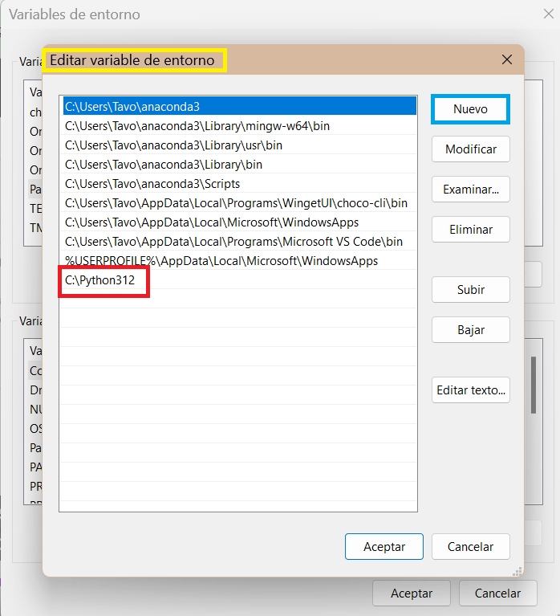
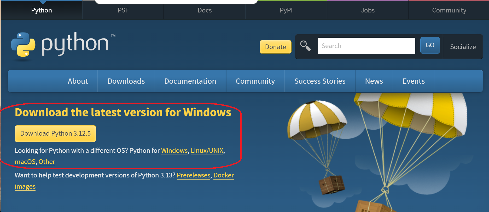
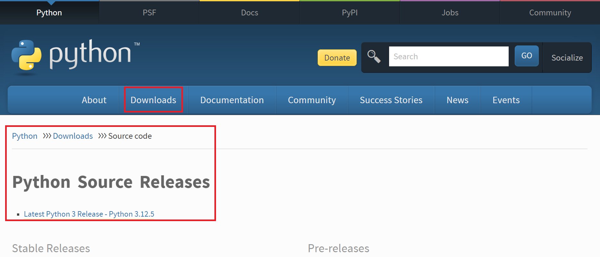
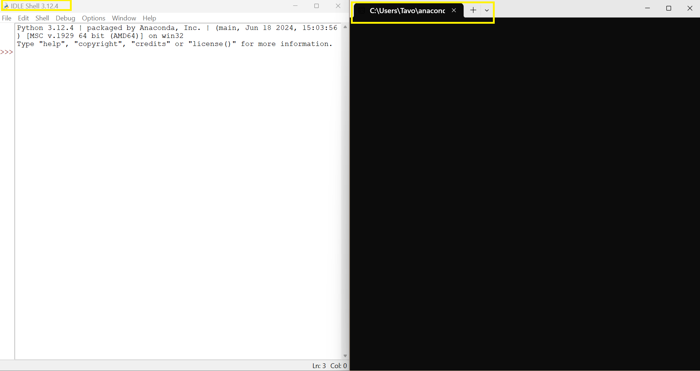
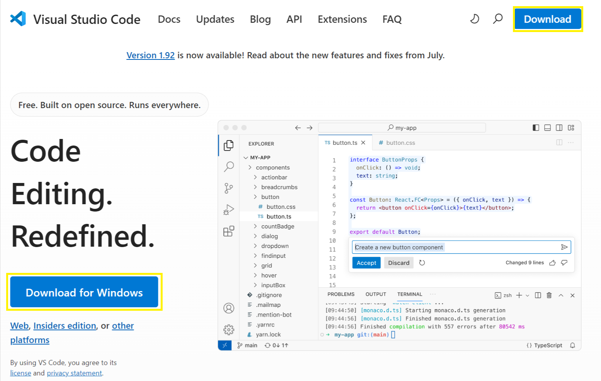
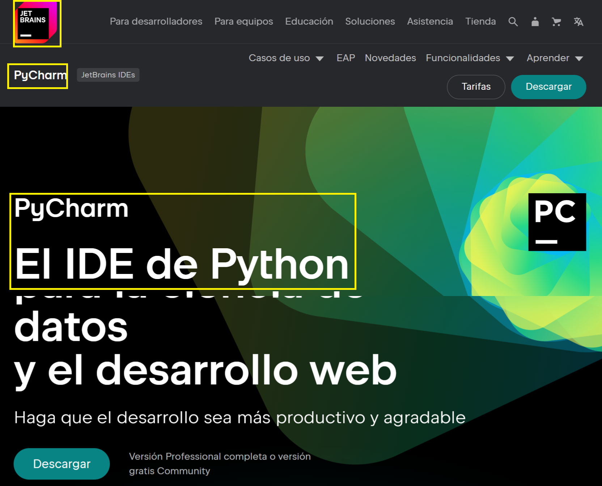

# **_PYTHON DESDE CERO_**

## **Introducción**

## **1. ¿Qué es Python?**

Python es un lenguaje de programación interpretado, de alto nivel y con una sintaxis clara y legible. Se utiliza en una amplia variedad de aplicaciones, desde desarrollo web hasta análisis de datos, inteligencia artificial y automatización de tareas, entre otras. Claro está que, lo dicho aquí no lo es un todO; solamente es un simple resumen muy personal del mundo que es **Python**.

## **2. Instalación de Python**

Antes de empezar a programar, se necesita instalar Python en el ordenador y/o computadora.

* **Windows**:

1. Se visita la página oficial de Python: [python.org](https://www.python.org/downloads/). Por favor ver la ilustración 1.

2. Descarga la última versión de Python.

3. Durante la instalación, asegúrate de marcar la casilla **"Add Python to PATH"**. Ver la ilustración 1.
_Ilustración 1_


4. Siguiendo los pasos de instalación intuitivos que brinda el programa se puede llegar a un feliz termino de esta instalación; ahora, solamente se puede asegurar  de que todo esté correctamente configurado; escribiendo en una terminal CMD python3 --version. Realmente los pasos son muy sencillos.

_Ilustración 2_

Fuente: [Python](<https://www.python.org/downloads/>) y Propia.

* **MacOS/Linux**:

1. Por favor ver la ilustración 3 debido ya que Python suele estar preinstalado en estos sistemas. Para esto se puede verificar abriendo una terminal o ejecutar la tecla Windows + la letra R (al mismo tiempo) dentro de esta terminal se escribe el siguiente comando: ```python3 --version```

_Ilustración 3_

 Fuente: [Python](<https://www.python.org/downloads/>) y Propia.
2. Si no está instalado, se puede instalar utilizando un gestor de paquetes como brew (en macOS) o apt-get (en Ubuntu).```brew install python```.

O en su defecto se puede escribir ```sudo apt-get install python3```

## **3. Configurar un Entorno de Desarrollo**

Inicialmente, para escribir y ejecutar el código en Python, se necesita un entorno de desarrollo. Pare esto se tienen algunas opciones y/o sugerencias:

* [IDLE](https://docs.python.org/3/library/idle.html) (Python's Integrated Development and Learning Environment): Este, viene con la instalación de Python. Es simple y fácil de usar para empezar.

_Ilustración 4_

Fuente: Propia.

* [VS Code](https://code.visualstudio.com/): Siendo este Un editor de texto poderoso y personalizable con soporte para Python.

_Ilustración 5_

Fuente: [Vs Code](https://code.visualstudio.com/) y propia.

* [PyCharm](https://www.jetbrains.com/es-es/pycharm/): Es un IDE más avanzado, con muchas herramientas para facilitar el desarrollo en Python.

_Ilustración 6_

Fuente: [PyCharm](https://www.jetbrains.com/es-es/pycharm/) y propia.

**NOTA**: Para este tutorial se utilizó el Editor de Texto VS Code. Pero es a discreción del usuario el editor que quiera utilizar.

## Creación de nuestro primer archivo

Estando ya dentro del editor; se procede a crear un archivo con el nombre que quiera utilizar el usuario; no sin antes advertir que debe de tener la extensión punto py (.py)

* [ ] #739
* [ ] <https://github.com/octo-org/octo-repo/issues/740>
* [ ] Add delight to the experience when all tasks are complete :tada:
